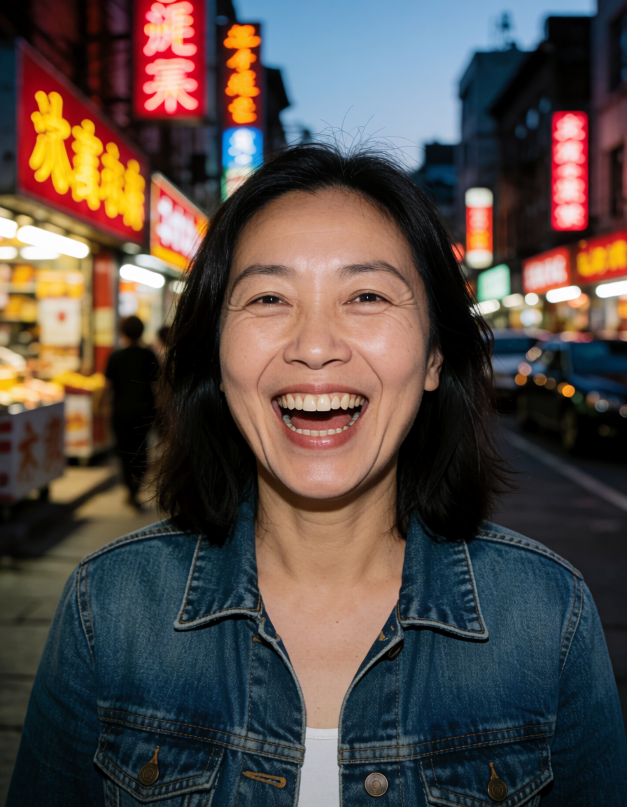
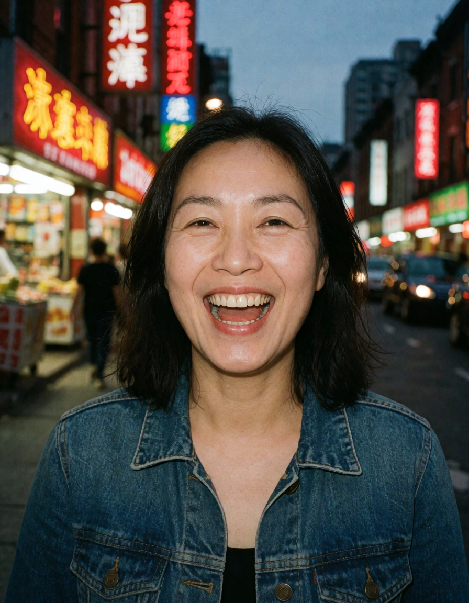

# Krea 2 Turbo on Apple Silicon (ComfyUI / MPS)

Run [Krea 2](https://huggingface.co/Comfy-Org/Krea-2) — the open-weights 12B DiT from Krea AI —
**fully locally on a Mac**, at 8 steps per image. This repo is the working recipe plus every
MPS-specific failure mode we hit getting there, so you don't burn the hours we did.

Krea 2 is commercially licensed, which makes it one of the few open t2i models whose output
you can ship to clients.

## Examples

All rendered locally on an M-series Mac with the exact workflows in this repo — bf16, 16 steps, no upscaler, no post. Same seed per pair; left is the bare workflow, right adds Realism Engine at 0.5.

| Bare | + Realism Engine 0.5 |
|---|---|
|  |  |
|  |  |
|  |  |
|  |  |

## Files

| File | What |
|---|---|
| `Krea2-Turbo_Mac.json` | Bare Turbo workflow — UNet → TE → 8-step sampler |
| `Krea2-Turbo-LoRA_Mac.json` | Same + a toggleable Realism Engine LoRA slot (Ctrl+B to bypass) |

Both ship with two in-graph info panels: a **model download panel** (direct HF links with
sizes and install paths) and a **recipe/gotchas panel** — you don't need this README open
while you work. 100% ComfyUI core nodes, no custom nodes.

## Requirements

- Apple Silicon Mac with **48 GB+ unified memory** (the bf16 UNet alone is ~26 GB)
- ComfyUI (recent build — needs the `krea2` CLIP type)
- Models from [Comfy-Org/Krea-2](https://huggingface.co/Comfy-Org/Krea-2):
  - `diffusion_models/krea2_turbo_bf16.safetensors`
  - `text_encoders/qwen3vl_4b_bf16.safetensors`
  - `vae/qwen_image_vae.safetensors`

**bf16 is not a choice, it's the only thing that runs.** The fp8 weights die on MPS
(`Float8_e4m3fn` is unsupported), and the ComfyUI-GGUF node predates the Krea 2 architecture.
Don't spend time "optimizing" — bf16 or nothing.

## The locked recipe

| Setting | Value |
|---|---|
| UNet | `UNETLoader` → `krea2_turbo_bf16.safetensors`, dtype `default` |
| Text encoder | `CLIPLoader` → `qwen3vl_4b_bf16.safetensors`, **type = `krea2`** |
| VAE | `qwen_image_vae.safetensors` (a Flux VAE decodes to scrambled noise) |
| Sampler | **16 steps · cfg 1.0 · euler · simple · denoise 1.0** |
| Negative | `ConditioningZeroOut` of the positive — at cfg 1 negatives are dead, don't write them |
| Latent | 1024×1024, 896×1152, 832×1216, or 1216×832 |

**Speed dial:** the workflows default to 16 steps (finals quality — the example images use
it). Turbo's design point is 8 steps: drop to 8 for 2× faster seed hunting. Same seed stays
composition-stable across the step change, so hunt at 8 and re-render keepers at 16.

At cfg 1 the positive prompt is the *only* steering. Write short comma-phrases in
training-caption shape, not prose:
`[framing], [pose/action], [expression], [clothing], [setting], [lighting]`.
State the expression explicitly every time or you get a neutral house-face.

## MPS gotchas (the reason this repo exists)

These are Apple-Silicon backend bugs, not Krea 2 bugs — most will bite you on any large
DiT in ComfyUI on a Mac.

1. **`batch_size` must be 1.** With batch > 1 on MPS, only the first latent is denoised —
   you get one good frame plus pure static. Larger batches at 832×1216 also spiked past
   48 GB and OOM-killed ComfyUI. Loop seeds one image per queue instead.
2. **Never set a LoRA to strength 0.0 — delete the node.** A `LoraLoaderModelOnly` at 0.0
   NaNs the model on MPS and renders pure black. A zeroed patch is *not* a no-op here.
3. **First render is slow, then fine.** Cold-loading ~26 GB takes minutes; keep ComfyUI
   warm between renders. Run *without* `--disable-smart-memory` so the model stays resident
   across a seed hunt — but if the same instance must also load another large model, batch
   all Krea 2 work first; two big models co-resident will OOM.
4. **Cheap black/noise detection:** render a 512px probe and check mean luminance
   (PIL `ImageStat`) — mean < 8 = black output (gotcha 2), > 150 = noise (gotcha 1).
   Beats eyeballing full-res renders one by one.

## Optional add-on: Realism Engine LoRA

[Realism Engine for Krea 2](https://civitai.com/models/3109006) is a skin/texture LoRA that
takes the edge off Turbo's distillation look. Load it with **`LoraLoaderModelOnly`** — the
full `LoraLoader` also patches the text encoder, which re-interprets your prompt and shifts
the whole image. The LoRA workflow ships with strength 0.5. To run without it, **toggle the node off with
Ctrl+B (bypass) or delete it** — never zero the strength (see gotcha 2).

**Identity drift warning:** at cfg 1 nothing anchors attributes you don't specify, and a
LoRA pulls every unspecified attribute toward its own training data. At 0.8 Realism Engine
changed a subject's ethnicity on the same seed; 0.5 mostly held it. For portraits: keep
strength at ~0.5 **and state ethnicity/age explicitly in the prompt** — pinned attributes
survive the LoRA, unpinned ones don't.

The same slot takes any Krea 2 model-only LoRA, including your own character LoRAs trained
on the undistilled Raw checkpoint (rank 32 / alpha 16 is a good starting point; disable
horizontal flip for asymmetric faces).

## Raw (undistilled)

`krea2_raw_bf16.safetensors` needs cfg ~4 and 25–30 steps. Use it as a LoRA-training base or
when the Turbo distillation look itself is the problem — for everything else Turbo at 8 steps
is the workhorse.
